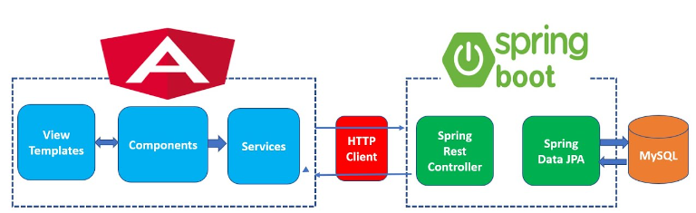
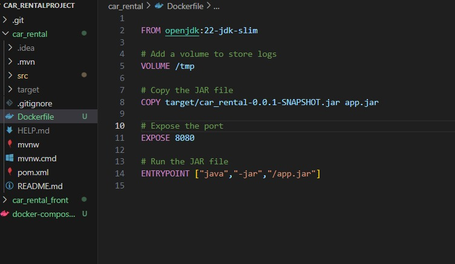
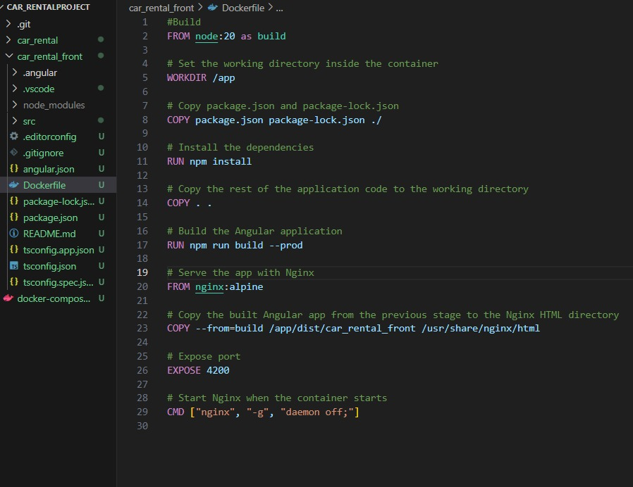
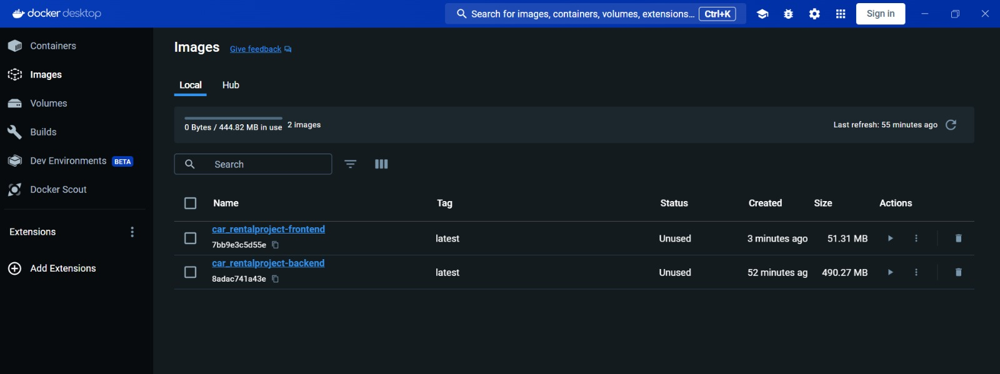
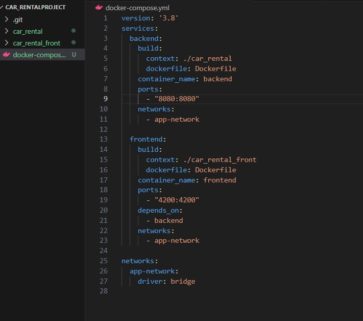
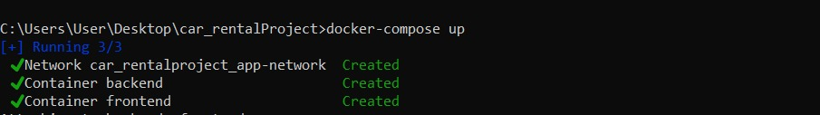
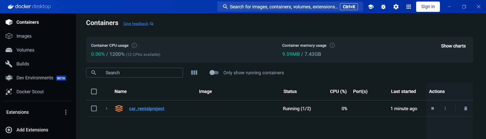

# Application de géolocalisation

Dans le monde en constante évolution de l'ingénierie et de la technologie, il est essentiel pour les étudiants en sciences et en ingénierie de relever des défis concrets. Ce projet de fin d'année représente une opportunité précieuse de développer nos compétences techniques, de renforcer notre capacité à travailler en équipe et de découvrir les exigences du marché.

Pour cela, notre projet de fin d'année consiste en la réalisation d'une application de gestion de flotte et de géolocalisation des véhicules.

## Table des matières

- [Introduction générale](#introduction-générale)
- [Architecture de l’Application](#Architecture-de-l-Application)
- [Docker](#Docker)

## Introduction générale

L'application de géolocalisation que nous envisageons de concevoir répond à un besoin urgent des entreprises : la gestion efficace de leur flotte de véhicules. En permettant le suivi en temps réel des véhicules, l'optimisation des itinéraires et la surveillance de l'état des véhicules, notre solution vise à apporter des gains significatifs en termes de productivité, de réduction des coûts et d'amélioration de la sécurité.

C’est dans ce cadre que s’inscrit la réalisation de notre projet qui consiste à développer une application de géolocalisation.

## Architecture de l’Application



L'architecture de notre application repose sur une séparation claire entre le front-end et le back-end, facilitant ainsi le développement, le déploiement et la maintenance. Voici les principaux composants :

- **Front-End : Angular**
  - **Templates et Composants** : Angular utilise des templates HTML et des composants pour afficher le contenu et gérer la logique de l'interface utilisateur.
  - **Services** : Les services Angular partagent des données et des fonctionnalités entre les composants.
  - **HTTP Client** : `HttpClient` d'Angular envoie des requêtes HTTP au back-end.
  
- **Back-End : Spring Boot**
  - **Spring Rest Controller** : Les contrôleurs REST gèrent les requêtes HTTP entrantes et définissent les points de terminaison de l'API.
  - **Spring Boot** : Simplifie le développement et le déploiement des applications Spring avec des configurations par défaut.
  - **Spring Data JPA** : Gère les opérations CRUD en interagissant avec la base de données via des référentiels JPA.
  
- **Base de Données : MySQL**
  - **MySQL** : Stocke les données de l'application dans une structure relationnelle, gérée via Spring Data JPA.
    
## Docker

### Dockerfile pour Spring Boot



### Dockerfile pour Angular



### Build image



### docker-compose.yml

Pour gérer les conteneurs Spring Boot et Angular.



### Containers




## Frontend

les technologies utilisées 
- Angular
- Bootstrap

### Structure Frontend du Projet 

### Dependences

Liste des dependencies principales pour angular frontend.

```json
{
   "dependencies": {
    "@angular/animations": "^17.3.0",
    "@angular/common": "^17.3.0",
    "@angular/compiler": "^17.3.0",
    "@angular/core": "^17.3.0",
    "@angular/forms": "^17.3.0",
    "@angular/platform-browser": "^17.3.0",
    "@angular/platform-browser-dynamic": "^17.3.0",
    "@angular/platform-server": "^17.3.0",
    "@angular/router": "^17.3.0",
    "@angular/ssr": "^17.3.6",
    "express": "^4.18.2",
    "ng-zorro-antd": "^17.4.0",
    "rxjs": "~7.8.0",
    "tslib": "^2.3.0",
    "zone.js": "~0.14.3"
  },
  "devDependencies": {
    "@angular-devkit/build-angular": "^17.3.6",
    "@angular/cli": "^17.3.6",
    "@angular/compiler-cli": "^17.3.0",
    "@types/express": "^4.17.17",
    "@types/jasmine": "~5.1.0",
    "@types/node": "^18.18.0",
    "jasmine-core": "~5.1.0",
    "karma": "~6.4.0",
    "karma-chrome-launcher": "~3.2.0",
    "karma-coverage": "~2.2.0",
    "karma-jasmine": "~5.1.0",
    "karma-jasmine-html-reporter": "~2.1.0",
    "typescript": "~5.4.2"
  }
}
```

## Backend

les technologies utilisées

- Spring Boot
- MySQL

### Structure Backend du Projet 

### Dependences
